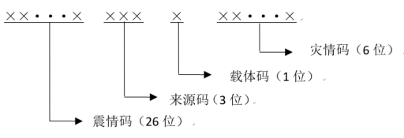
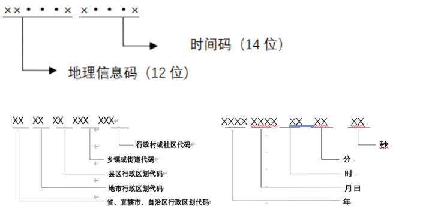
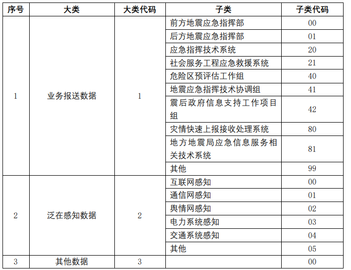
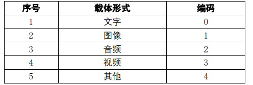
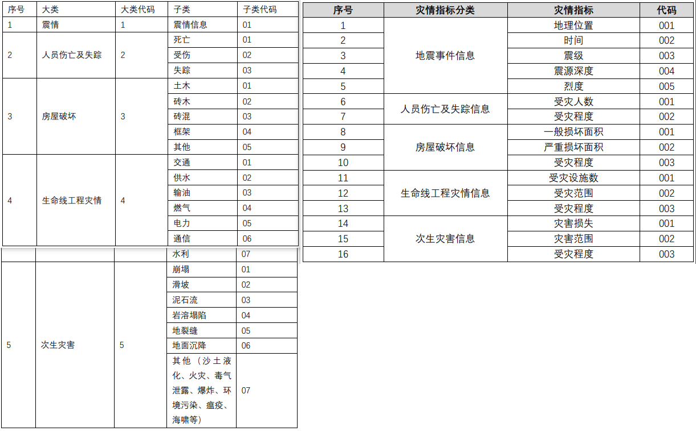
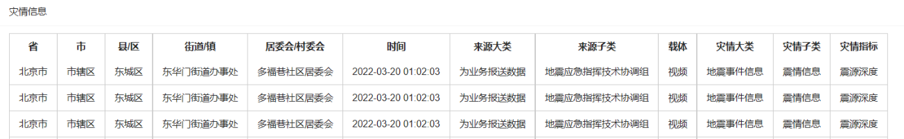

# 灾情数据的一体化编码管理 

通过接口读取一体化编码的多源异构灾情，对灾情信息进行统一管理，进行必要的可视化。 

## 编码规范

+ 采用分层和组合编码方法，分为 4 段，依次为震情码、来 源码、载体码、灾情码。其中： 
  + 第一段震情码用于描述地震灾害事件属性信息，用 26 位阿拉伯数字标识；

  + 第二段来源码用于描述灾情报送单位，用 3 位阿拉伯数字标识； 

  + 第三段载体码用于描述灾情载体类型，用 1 位阿拉伯数字标识； 

  + 第四段灾情码描述灾情数据的具体信息，用 6 位阿拉伯数字标识。

    

1. 震情编码 

   震情编码采用分层组合编码方法，依次为地理信息编码和时间编码。其中： 

   + 第一段地理信息码用于描述基础地理信息，用 12 位阿拉伯数字标识； 

   + 第二段时间码用于记录地震发生的具体时间和具体时刻，用 14 位阿拉伯数字标识。 

     

2. 来源编码 

   采用组合码，分为两 段，由 3 位阿拉伯数字组成。

   + 第一段表示大类代码，由 1 位阿拉伯数字表示，分别对应三种数据来源；

   + 第二段表示子类代码，由 2 位阿拉伯数字表示，采用系列顺序码，在各类别代码取值范 围内对编码对象顺序地赋予代码值。

      

   

3. 载体编码

   用于描述灾情数据载体类型，用 1 位阿拉伯数字标识

   

4. 灾情编码 

   采用组合码，分为 3 段

   + 第一段表示灾害大类代码，由 1 位阿拉伯数字表示 

   + 第二段表示灾害子类代码，由 2 位阿拉伯数字表示，参见左表。
   + 第三段表示灾情指标代码，由 3 位阿拉伯数字表示，参见右表。
   + 示例： 次生灾害中的岩溶塌陷，编码为 444004。

   

+ 编码举例： 

  青海地震来自后方地震应急指挥部发来的砖木房屋一般损坏面积的灾情信息，

  统一编码为： ID=632626200206202105220204001010302001

## 功能展示

+ 读取编码：直接提交灾情码，或提交txt、excel文件

  

+ 灾情解码：将编码信息还原为灾情信息，在列表中展示

  

+ GIS可视化：统计不同地区灾情数量，在地图上展示

  

